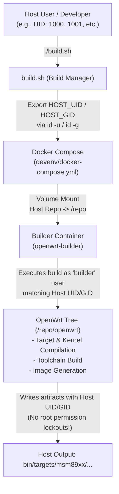
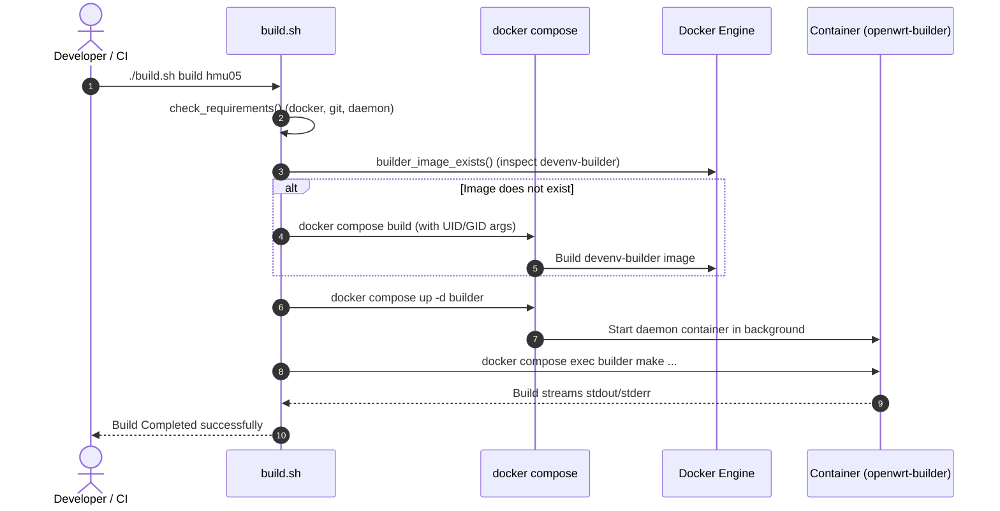

# Docker Build Environment Architecture & Management Guide

Comprehensive guide explaining the containerized build system, dynamic host user synchronization (UID/GID), container lifecycle orchestration, and build execution in **OpenWrt for Qualcomm MSM8916**.

---

## 1. Overview & Architectural Philosophy

Compiling OpenWrt firmware and cross-compiling kernel components for Qualcomm MSM8916 (AArch64 / ARMv7 / 32-bit Hyp / Modem interfaces) requires extensive build toolchains, specific cross-compilers (`gcc-aarch64-linux-gnu`, `gcc-arm-none-eabi`), Python modules, device-tree compilers, cryptographic tools, and specific system library versions.

To guarantee **100% deterministic builds**, prevent host OS pollution, and ensure seamless operation across disparate developer machines and GitHub Actions CI runners, all compilation occurs inside a containerized Docker build environment.



---

## 2. Component Breakdown

The container environment is structured under the [`devenv/`](../../devenv/) directory and orchestrated through root scripts:

```
msm8916-openwrt/
├── build.sh                     # Host-side orchestrator and Docker caller
├── devenv/
│   ├── .env                     # Project version configuration (OPENWRT_VERSION)
│   ├── Dockerfile               # Base Ubuntu 22.04 image with builder user
│   ├── dependencies.sh          # Dependency installation script
│   └── docker-compose.yml       # Service definition, mounts, user mapping
├── scripts/
│   ├── openwrt-prepare.sh       # In-container tree prep & feed synchronization
│   └── openwrt-version.sh       # Target version switch helper
└── Docs/
    └── Docker/
        └── README.md            # This documentation
```

### 2.1. `devenv/Dockerfile`
Builds an image (`devenv-builder`) based on `ubuntu:22.04`:
1. Executes `devenv/dependencies.sh` to install all required toolchains and dependencies.
2. Accepts build arguments `UID` and `GID`.
3. Creates a non-root user `builder` matching the specified UID and GID, adds it to the `sudo` group with passwordless sudo rights.
4. Sets default `WORKDIR /repo/openwrt` and non-root `USER builder`.

### 2.2. `devenv/dependencies.sh`
Installs all host prerequisites in a single cached layer:
- **Build Essentials & Core Tools**: `gcc`, `g++`, `make`, `binutils`, `bzip2`, `patch`, `gawk`, `flex`, `bison`, `bc`, `time`.
- **Cross Compilers**: `gcc-aarch64-linux-gnu` (64-bit kernel/userspace), `gcc-arm-none-eabi` (bare-metal firmware / secondary loaders like lk2nd and qhypstub).
- **Android / Qualcomm Tools**: `mkbootimg`, `device-tree-compiler` (dtc), `e2fsprogs`, `fdisk`, `util-linux`.
- **Libraries & Headers**: `libelf-dev`, `libfdt-dev`, `libncurses5-dev`, `libssl-dev`, `zlib1g-dev`.
- **Scripting & Interpreters**: `python3-dev`, `python3-setuptools`, `python3-cryptography`, `perl`, `golang-go`, `swig`.

### 2.3. `devenv/docker-compose.yml`
Defines the `builder` service configuration:
- **Image**: `devenv-builder`
- **Container Name**: `openwrt-builder`
- **Build Context & Args**: Passes host UID/GID dynamically via `${HOST_UID:-1000}` and `${HOST_GID:-1000}`.
- **User Mapping**: `user: "${HOST_UID:-1000}:${HOST_GID:-1000}"` ensuring operations run with matched host permissions.
- **Volume Mounts**: Maps root repository `..` to `/repo` inside container.
- **Networking**: `network_mode: host` to enable unrestricted access for feed updates, source tarball downloads, and proxy environments.
- **Interactive TTY**: `stdin_open: true` and `tty: true` for `make menuconfig` and interactive container shells.

### 2.4. `devenv/.env`
Stores project-level configuration:
```env
OPENWRT_VERSION=v25.12.5
```
*(Dynamic user IDs are no longer stored here to avoid hardcoded environment pollution across different developer systems).*

---

## 3. Host User Synchronization (UID / GID)

### 3.1. The Root Problem: File Permissions in Docker
When Docker mounts a host directory into a container (`-v $(pwd):/repo`), files created by processes inside the container inherit the numeric UID/GID of the container user.

- **If the container runs as `root` (UID 0)**: Files written to the host (e.g. `openwrt/bin/`, `.config`, build artifacts) are owned by `root`. The host developer cannot edit, git checkout, or `rm -rf` these files without `sudo`.
- **If the container runs as hardcoded `UID=1001`**: A developer on a host where their UID is `1000` (standard Ubuntu default) will find all generated files owned by `1001`, causing `Permission denied` errors.
- **If the container runs as hardcoded `UID=1000`**: A developer with UID `1001` (such as on multi-user systems or CI runners) encounters the same permission conflict.

### 3.2. Why `HOST_UID=1001` in `.env` Was an Anti-Pattern
Previously, `devenv/.env` contained:
```env
HOST_UID=1001
HOST_GID=1001
```
Because `devenv/.env` is tracked by git:
1. It hardcoded the specific UID of one machine (`1001`).
2. Any developer cloning the repository on a standard `1000:1000` setup was forced to use UID `1001`, breaking file ownership on their local machine.
3. It required manual `.env` edits for every new developer or machine.

### 3.3. The Portable Dynamic Solution
The build system dynamically determines and propagates the host user's UID/GID at runtime:

1. **In [`build.sh`](../../build.sh)**:
   The `docker_compose()` wrapper automatically evaluates the current user via `id -u` and `id -g`:
   ```bash
   docker_compose() {
       HOST_UID="${HOST_UID:-$(id -u)}" \
       HOST_GID="${HOST_GID:-$(id -g)}" \
       docker compose \
           -f "$COMPOSE_FILE" \
           "$@"
   }
   ```
2. **In [`devenv/docker-compose.yml`](../../devenv/docker-compose.yml)**:
   Defaults to `1000` if invoked without `build.sh`, but uses the exported `HOST_UID` and `HOST_GID` when invoked via `build.sh`:
   ```yaml
   args:
     UID: ${HOST_UID:-1000}
     GID: ${HOST_GID:-1000}
   user: "${HOST_UID:-1000}:${HOST_GID:-1000}"
   ```
3. **In [`devenv/Dockerfile`](../../devenv/Dockerfile)**:
   The user creation logic safely handles existing groups and users:
   ```dockerfile
   ARG UID=1000
   ARG GID=1000

   RUN if ! getent group ${GID} >/dev/null; then \
           groupadd -g ${GID} builder; \
       fi && \
       if ! getent passwd ${UID} >/dev/null; then \
           useradd -m -u ${UID} -g ${GID} -G sudo builder; \
       fi && \
       echo '%sudo ALL=(ALL) NOPASSWD:ALL' >> /etc/sudoers
   ```

**Result**:
- Works out-of-the-box for any user (`UID 1000`, `UID 1001`, macOS users, CI runners).
- Zero manual `.env` file changes needed.
- Generated build outputs and git worktrees are always owned by the caller.

---

## 4. Container Lifecycle & Invocation Flow

The host script [`build.sh`](../../build.sh) manages the entire lifecycle of the container transparently.



### 4.1. Core Orchestration Functions in `build.sh`

| Function | Purpose | Implementation Details |
| :--- | :--- | :--- |
| `check_requirements()` | Pre-flight check | Verifies `docker` CLI, running daemon, `git`, and required helper scripts. |
| `docker_compose()` | Compose wrapper | Sets dynamic `HOST_UID` / `HOST_GID` and targets `devenv/docker-compose.yml`. |
| `builder_image_exists()` | Image validation | Checks if `devenv-builder` image is present in Docker daemon. |
| `build_image()` | Builds container | Runs `docker compose build` and invalidates `.builder-state`. |
| `ensure_builder()` | Service assurance | Builds image if missing, starts container via `up -d`, and checks health. |
| `docker_exec()` | In-container command runner | Invokes `docker_compose exec builder "$@"`. |
| `run_openwrt_make()` | Make task runner | Executes `make` targets inside `/repo/openwrt` with verbose logging on failure. |

---

## 5. Developer Workflows & Commands

All interaction is handled through `./build.sh`. You rarely need to call `docker` or `docker compose` manually.

### 5.1. Common Commands

```bash
# 1. Build or update the Docker image
./build.sh image

# 2. Prepare the OpenWrt source tree inside the container
./build.sh prepare

# 3. Compile firmware for a specific board
./build.sh build hmu05

# 4. Compile firmware for all supported boards (hmu05, ufi001b, uz801, uf02)
./build.sh build all

# 5. Clean and rebuild
./build.sh rebuild hmu05

# 6. Run interactive menuconfig inside the container
./build.sh menuconfig hmu05

# 7. Save updated kernel/package config back to board diffconfig
./build.sh saveconfig hmu05

# 8. Open an interactive shell inside the running builder container
./build.sh shell

# 9. Clean build directories
./build.sh clean      # make clean
./build.sh dirclean   # make dirclean
./build.sh distclean  # make distclean
```

### 5.2. Direct Container Shell Access
If you need direct debugging access inside the container:
```bash
./build.sh shell
```
Inside the container:
- Working directory is `/repo/openwrt`.
- You are logged in as `builder` (with passwordless `sudo`).
- The entire project repository is mounted at `/repo`.

---

## 6. Continuous Integration (GitHub Actions)

In GitHub Actions workflows (e.g. [`.github/workflows/build-and-release.yml`](../../.github/workflows/build-and-release.yml)), the pipeline executes identically to a local environment:

1. Runner user is `runner` (`UID 1001`, `GID 127` or `1001`).
2. `./build.sh prepare` automatically captures `HOST_UID=1001` and `HOST_GID=1001` from the runner environment.
3. The image is built and starts `openwrt-builder`.
4. Build targets output directly into `openwrt/bin/targets/msm89xx/default/`.
5. Checksum generation and release packaging read the files immediately without permission conflicts.

---

## 7. Troubleshooting & FAQ

### Q1: Permission denied when editing files on the host after building in Docker
**Cause**: The Docker container was started with a UID different from your host user ID (e.g. if files were previously built with hardcoded UID 1000 while you are UID 1001).  
**Solution**:
1. Fix existing file ownership once:
   ```bash
   sudo chown -R $(id -u):$(id -g) .
   ```
2. Rebuild the image to register your current UID:
   ```bash
   ./build.sh image
   ```

### Q2: Container fails to start or says `service failed to start`
**Check container status and logs**:
```bash
docker compose -f devenv/docker-compose.yml logs builder
docker ps -a | grep openwrt-builder
```
**Reset and recreate the container**:
```bash
docker compose -f devenv/docker-compose.yml down -v
./build.sh prepare
```

### Q3: How to force rebuild the Docker image without cache?
```bash
docker compose -f devenv/docker-compose.yml build --no-cache
```

### Q4: OpenWrt feeds fail to download inside container
Because `docker-compose.yml` uses `network_mode: host`, the container shares the host's exact network interfaces, DNS, and routing tables.
- If you use a corporate proxy or VPN, ensure `http_proxy` / `https_proxy` are exported on the host before running `./build.sh`.
- Test network inside container:
  ```bash
  ./build.sh shell
  curl -I https://git.openwrt.org
  ```
