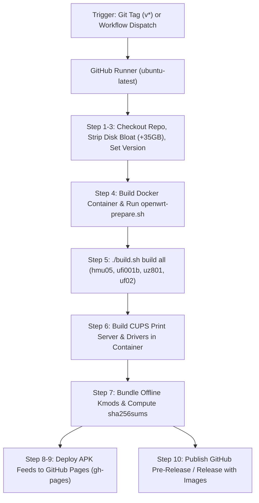

# GitHub Actions CI/CD Architecture & Workflow Guide

Comprehensive guide explaining the design, configuration, execution flow, automated packaging, and release deployment of the GitHub Actions CI/CD pipeline for **OpenWrt on Qualcomm MSM8916** devices.

---

## 1. System Overview & Architecture

The build pipeline automates the entire lifecycle of compiling OpenWrt firmwares, building modular kernel packages, deploying package repositories to GitHub Pages, and publishing GitHub Releases.



---

## 2. Workflow Specification (`.github/workflows/build-and-release.yml`)

The workflow definition is located at [`.github/workflows/build-and-release.yml`](../../.github/workflows/build-and-release.yml):

```yaml
name: Build OpenWrt MSM8916 & Release

on:
  push:
    tags:
      - "v*"
  workflow_dispatch:
    inputs:
      release_tag:
        description: "Release tag (e.g. v25.12.5-r1, leave empty to use current version)"
        required: false
        default: ""

permissions:
  contents: write
  pages: write
  id-token: write

jobs:
  build:
    name: Build All Boards, Kmods & Release
    runs-on: ubuntu-latest
```

### Key Trigger Modes:
1. **Tag Push (`v*`)**: Pushing a tag like `v25.12.5-rc1` or `v25.12.5-r1` automatically executes the entire build and creates the corresponding release.
2. **Manual Dispatch (`workflow_dispatch`)**: Allows manual triggering from the GitHub Actions UI with custom release tag parameters without pushing new git commits.

---

## 3. Step-by-Step Pipeline Walkthrough

### Step 1: Checkout Repository
- Uses `actions/checkout@v4` with `fetch-depth: 0` to preserve the complete git history and tag metadata.

### Step 2: Free Disk Space on Runner
- Standard GitHub Ubuntu runners have limited disk space (~30 GB).
- The workflow removes pre-installed .NET runtimes, MySQL databases, PHP versions, and Android SDKs to free **~35 GB** of additional storage, ensuring parallel multi-target compilation has sufficient headroom.

### Step 3: Determine Release Tag & Version
- Extracts the tag from `${GITHUB_REF}` or workflow input.
- Reads `version` file (`25.12.5`) to format release names and paths.

### Step 4: Build Docker Image & Prepare OpenWrt Tree
- Invokes `./build.sh prepare`.
- Builds the `openwrt-builder` Docker container from `devenv/Dockerfile`.
- Runs `scripts/openwrt-prepare.sh`:
  - Clones and validates OpenWrt source tree.
  - Syncs package feeds (`packages`, `luci`, `routing`, `telephony`, `video`) and verifies index files (`feeds/*.index`).
  - Installs board targets to `target/linux/msm89xx`.
  - Links project packages into `package/msm8916/`.
  - Applies essential patches and compatibility fixes.

### Step 5: Compile All Firmware Images
- Runs `./build.sh build all` inside the container.
- Compiles OpenWrt kernel (`boot.img`), SquashFS rootfs (`system.img`), and sysupgrade archives (`sysupgrade.bin`) across all 4 supported boards:
  1. `hmu05` (Generic MSM8916 4G USB Dongle / Router)
  2. `ufi001b` (Generic UFI001B 4G Stick)
  3. `uz801` (YiMing UZ801v3 4G Stick)
  4. `uf02` (Generic UF02 250605 V0S 4G Stick)

### Step 6: Compile Extra Packages (CUPS Print Server)
- Executes `make package/msm8916/cups/compile package/index V=s`.
- Compiles the CUPS network print daemon (`cupsd`), CUPS client tools (`lp`, `lpstat`, `cancel`), USB printer kernel module (`kmod-usb-printer`), and updates package indexes (`packages.adb`).

### Step 7: Package Offline Kmod Bundle & Checksums
- Bundles all target-compiled `.apk` packages into `kmods-msm8916-<version>.tar.gz`.
- Computes SHA-256 checksums across all flashable firmware images and the kmod archive:
  ```bash
  sha256sum openwrt-msm89xx-msm8916-generic-hmu05-* \
            openwrt-msm89xx-msm8916-generic-ufi001b-* \
            openwrt-msm89xx-msm8916-yiming-uz801v3-* \
            openwrt-msm89xx-msm8916-generic-uf02-* \
            kmods-msm8916-${VERSION}.tar.gz > sha256sums
  ```

### Step 8 & 9: Deploy Package Feeds to GitHub Pages
- Structures the web repository directory layout:
  ```text
  /releases/<version>/targets/msm89xx/msm8916/packages/
  /releases/<version>/packages/aarch64_generic/base/
  ```
- Deploys via `peaceiris/actions-gh-pages@v4` to the **`gh-pages`** branch with `keep_files: true` so prior versions are preserved.

### Step 10: Publish GitHub Release
- Uses `softprops/action-gh-release@v2` with `prerelease: true`.
- Automatically attaches all `.img`, `.bin`, `.zip`, and `.tar.gz` files along with `sha256sums` and release notes.

---

## 4. Release Artifacts Generated

| Artifact File | Description | Target Use Case |
| :--- | :--- | :--- |
| `*-squashfs-boot.img` | Android boot image (Kernel + DTB) | Fastboot / EDL flashing |
| `*-squashfs-system.img` | Read-only SquashFS rootfs image | Fastboot / EDL flashing |
| `*-squashfs-sysupgrade.bin` | Tarball archive with metadata | Web LuCI / CLI Sysupgrade |
| `*-firmware.zip` | Full firmware + partition script | Total unbricking / EDL recovery |
| `kmods-msm8916-<version>.tar.gz` | Offline archive of all target kmods | Offline package installation |
| `sha256sums` | Cryptographic verification hashes | Release file integrity checking |

---

## 5. Live Package Repository (GitHub Pages)

The workflow automatically serves an OpenWrt APK package repository over GitHub Pages:

### Feed URLs:
- **Target Drivers & Kmods**:
  `https://akbar-npj.github.io/msm8916-openwrt/releases/25.12.5/targets/msm89xx/msm8916/packages`
- **Base Architecture Packages**:
  `https://akbar-npj.github.io/msm8916-openwrt/releases/25.12.5/packages/aarch64_generic/base`

### On-Device Configuration:
Add these repositories to `/etc/apk/repositories.d/customfeeds.list`:
```text
https://akbar-npj.github.io/msm8916-openwrt/releases/25.12.5/targets/msm89xx/msm8916/packages
https://akbar-npj.github.io/msm8916-openwrt/releases/25.12.5/packages/aarch64_generic/base
```

Install packages over the air:
```bash
apk update
apk add cups-daemon cups-client kmod-sched-cake kmod-usb-printer kmod-bluetooth
```

---

## 6. How to Trigger & Replace Pre-Release Tags

When changes are merged into `main` and you want to trigger a fresh build and replace the pre-release tag:

```bash
# 1. Ensure local main is up-to-date
git checkout main
git pull origin main

# 2. Update the local tag to the latest commit
git tag -f v25.12.5-rc1

# 3. Force push the tag to GitHub to trigger the action
git push origin v25.12.5-rc1 --force
```

GitHub Actions will immediately pick up the tag update, compile all 4 boards, update the GitHub Pages feed, and overwrite the release assets with the newly compiled build.

---

## 7. Caching & Build Acceleration (actions/cache@v4)

To prevent recompiling host utilities, toolchains, and re-downloading upstream source packages from scratch on every run, the workflow leverages GitHub Actions caching:

### Cached Directories:
1. **`openwrt/dl` (~1.5 GB)**: Upstream tarballs and package repositories.
2. **`openwrt/staging_dir/toolchain-aarch64_generic_gcc-14.3.0_musl` (~2 GB)**: Compiled GCC 14 + musl cross-toolchain binaries.
3. **`openwrt/staging_dir/host` (~1 GB)**: Host build tools (cmake, meson, ninja, mkbootimg, etc.).

### Cache Configuration:
```yaml
- name: Cache OpenWrt Downloads & Toolchain
  uses: actions/cache@v4
  with:
    path: |
      openwrt/dl
      openwrt/staging_dir/toolchain-aarch64_generic_gcc-14.3.0_musl
      openwrt/staging_dir/host
    key: openwrt-cache-${{ steps.vars.outputs.version }}-${{ hashFiles('openwrt/feeds.conf.default', 'diffconfigs/hmu05') }}-${{ github.run_id }}
    restore-keys: |
      openwrt-cache-${{ steps.vars.outputs.version }}-${{ hashFiles('openwrt/feeds.conf.default', 'diffconfigs/hmu05') }}-
      openwrt-cache-${{ steps.vars.outputs.version }}-
      openwrt-cache-
```

### Performance Impact:
- **First Build (Cold Cache)**: ~75 minutes.
- **Successive Builds (Warm Cache)**: **~12–15 minutes** (5x speedup).

