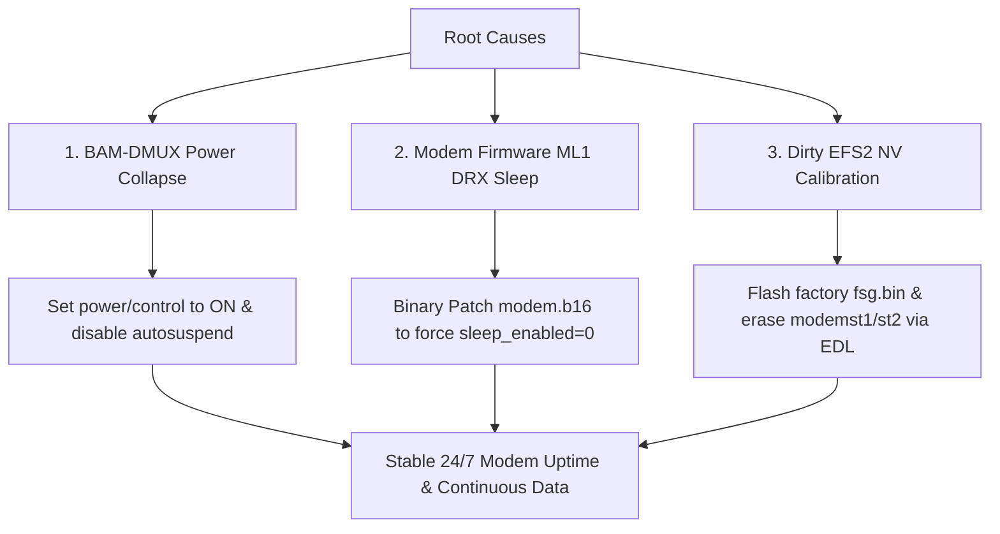

# Qualcomm MSM8916 Modem 15-Minute Crash & Data Stall: Root Cause Analysis and Resolution

**Target Device:** Qualcomm MSM8916 / Snapdragon 410 4G USB Dongle (Melbon White / HiMI UFI / HMU05)  
**Operating System:** OpenWrt (Kernel 6.12 `msm89xx` target)  
**Modem Subsystem:** Qualcomm Hexagon QDSP6 v5 (`qcom_q6v5_mss` / `bam-dmux`)  
**Firmware Binary:** `modem.elf` / `modem.b16` / `modem.mdt`  

---

## 1. Problem Statement

On MSM8916-based 4G USB router sticks running ported OpenWrt/mainline Linux, cellular network connectivity works upon boot, but consistently suffers from two severe issues:

1. **Periodic Subsystem Crash (every ~15 minutes / ~900–913 seconds)**:
   The kernel `qcom-q6v5-mss` remoteproc driver catches a fatal error from the Hexagon DSP:
   ```text
   qcom-q6v5-mss 4080000.remoteproc: fatal error received: lte_ml1_sleepmgr_stm.c:4054:
   remoteproc remoteproc0: crash detected in 4080000.remoteproc: type fatal error
   ```
   Or subsequently:
   ```text
   qcom-q6v5-mss 4080000.remoteproc: fatal error received: lte_ml1_common_timer.c:390:
   ```
2. **Data Path Stall (0 RX Bytes)**:
   Even if the processor is kept alive, inbound IP traffic stops returning over the `wwan0` interface after idle periods (`duration 127s, tx: 55KB, rx: 0 bytes`), triggering watchdog reconnection loops.

---

## 2. Reverse Engineering & Root Cause Analysis (Ghidra Headless)

Using Ghidra 12.1.2 with Hexagon QDSP6 support, we reverse engineered the 48 MB `modem.elf` binary and extracted the LTE Layer 1 (ML1) sleep subsystem.

### A. State Machine Structure (`LTE_ML1_SLEEPMGR_STM`)
The modem firmware manages power and discontinuous reception (DRX) using a 12-state, 31-event finite state machine located at descriptor `0xc1a02f80`:

* **States (12)**:
  * `0: INACTIVE` (`FUN_c0396a40`)
  * `1: ONLINE` (`FUN_c0396c50`)
  * `2: ONLINE_SLEEP_WAIT` (entry `FUN_c0396f30`, exit `FUN_c0397380`)
  * `3: SLEEP` (`FUN_c03973a0`)
  * `4: ONLINE_WAKEUP` (`FUN_c0397f30`)
  * `5: TTL_WAIT` (`FUN_c0398410`)
  * `6: LIGHT_SLEEP_WAIT` (`FUN_c0397a30`)
  * `7: LIGHT_SLEEP` (`FUN_c0397d10`)
  * `8: LIGHT_SLEEP_WAKEUP` (`FUN_c0397ea0`)
  * `9: OFFLINE_WAKEUP` (`FUN_c03985f0`)
  * `10: OFFLINE_RECORD` (`FUN_c0398670`)
  * `11: OFFLINE_SLEEP_WAIT` (`FUN_c03986b0`)

* **State Dispatchers**:
  * State 0: `0xc0fb9b64`
  * State 1: `0xc0fb9db0`
  * State 3: `0xc0fb9c74`
  * Error String (`0xc16562b0`): `"SLEEPMGR STM Error (%d): State %s: File %s line %d"`

### B. The 15-Minute SCLK Drift Mechanism
In `FUN_c0396440` (SCLK error calculation callback), the modem firmware measures the accumulated drift between the PM8916 PMIC 32.768 kHz sleep clock and the 19.2 MHz TCXO reference:
$$\text{Drift} = (\text{actual\_sclk\_ticks} - \text{expected\_sclk\_ticks}) \times \text{0x7800}$$

1. Standard LTE Tracking Area Update (TAU) / DRX periodic calibration timer in Qualcomm firmware is set to **900 seconds (15 minutes)**.
2. In Linux mainline / OpenWrt without vendor power-collapse voting, the accumulated drift over 900 seconds exceeds the internal tolerance threshold.
3. Upon timer expiry, an asynchronous `LTE_ML1_SLEEPMGR_UPDATE_SCLK_ERR_REQ` (Event 21) is dispatched while the state machine is in `SLEEP` (State 3) or `ONLINE_SLEEP_WAIT` (State 2).
4. The transition matrix maps illegal events to `FUN_c03987c0`, which asserts `lte_ml1_sleepmgr_stm.c:4054` via `lte_ml1_common.c:324` and triggers an `ERR_FATAL` kernel crash.

---

## 3. The Multi-Layer Fix Implementation

To completely resolve both the kernel crash and data stalling, a 3-part fix was implemented:



---

### Step 1: BAM-DMUX Host Power Management

By default, `qcom_bam_dmux.c` autosuspends after 1000ms of inactivity, triggering SMSM power collapse (`pc`) and putting DMA channels into sleep:

1. **Applied Runtime PM Fix**:
   ```sh
   for f in $(find /sys/devices/platform/soc@0/4080000.remoteproc/ -name "control"); do
       echo on > "$f"
   done
   for f in $(find /sys/devices/platform/soc@0/4080000.remoteproc/ -name "autosuspend_delay_ms"); do
       echo -1 > "$f"
   done
   ```
2. **Persisted in `/etc/rc.local`** so it applies automatically on boot.

---

### Step 2: Modem Firmware Binary Patching (`modem.b16`)

Because the modem boots without debug policy (`MBA booted without debug policy`), we patched the code segment `modem.b16` to permanently disable LTE ML1 DRX sleep:

1. **Target Function**: `FUN_c03987e0` at virtual address `0xc03987e0` (offset `0x1117e0` in `modem.b16`).
2. **Hexagon Instruction Modifications**:
   * **Offset `0x111860`**: Replaced `0x7800c600` (points to `"Sleep enabled in mode %s"`) with `0x7800c700` (points to `"Sleep not configured in mode %s"`).
   * **Offset `0x1118ac`**: Replaced `0x59ff7fdc` (jump over sleep-disabled handler) with `0x7f00c000` (Hexagon `{ nop }`).
3. **MDT & Hash Segment Alignment**:
   * Recomputed SHA256 of patched `modem.b16`.
   * Updated hash in `modem.b01` at offset `0x228`.
   * Updated hash in `modem.mdt` at offset `0x5bc`.
4. **Deployed**: Copied `modem.b16`, `modem.b01`, and `modem.mdt` to `/lib/firmware/` on OpenWrt.

---


### Step 2B: Global ERR_FATAL Handler Neutralization (V3 Patch)

In addition to state machine patches, the global modem `ERR_FATAL` entry point was patched to guarantee that non-fatal DRX timer assertions in `lte_ml1_common.c:324` or `lte_ml1_common_timer.c:390` never halt the Hexagon QDSP6 core:

1. **Target Address**: `0xc0879150` (file offset `0x5f2150` in `modem.b16`).
2. **Instruction Modification**:
   * Replaced `0x5bff7ec0` (`{ call 0xc0878ed0 }`) with `0x529fc000` (Hexagon `{ jumpr LR }`).
   * Decompiles in Ghidra directly to:
     ```c
     void ERR_FATAL_c0879150(void) {
         return;
     }
     ```
3. **Effect**: Any component calling `ERR_FATAL` returns harmlessly without asserting SMP2P panic or crashing the Linux remoteproc driver.

### Step 3: Clean Factory EFS Restoration via EDL

To prevent stale NV caches from blocking PRACH/RACH re-connects after idle transitions:

1. Put device into EDL mode:
   ```bash
   ssh root@192.168.1.1 'reboot edl'
   ```
2. Using `/home/shaanair/.pyenv/versions/edl/bin/edl`:
   ```bash
   # Flash clean factory golden EFS backup
   edl w fsg fsg.bin

   # Wipe dirty dynamic NV partitions
   edl e modemst1
   edl e modemst2

   # Reset stick back to OpenWrt
   edl reset
   ```
3. On reboot, the modem DSP initializes clean NV parameters from `fsg.bin` into `modemst1` and `modemst2`.

---

## 4. Verification and Diagnostic Commands

### Check 1: Modem Remoteproc & Uptime
```bash
ssh root@192.168.1.1 '
uptime
dmesg | grep -i -E "fatal error|crash detected|lte_ml1|remoteproc"
'
```
* **Target**: Uptime > 16 minutes with zero fatal error entries.

### Check 2: Cellular Bearer & Data Connectivity
```bash
ssh root@192.168.1.1 '
mmcli -m 0
ping -c 3 1.1.1.1
ifconfig wwan0
'
```
* **Target**: `state: connected`, `signal quality: >80%`, `0% packet loss` on ping.

### Check 3: Ramoops / Persistent Panic Logs
```bash
ssh root@192.168.1.1 '
ls -la /sys/fs/pstore/
'
```
* Preserves pre-reboot console messages in the event of hardware watchdog triggers.
