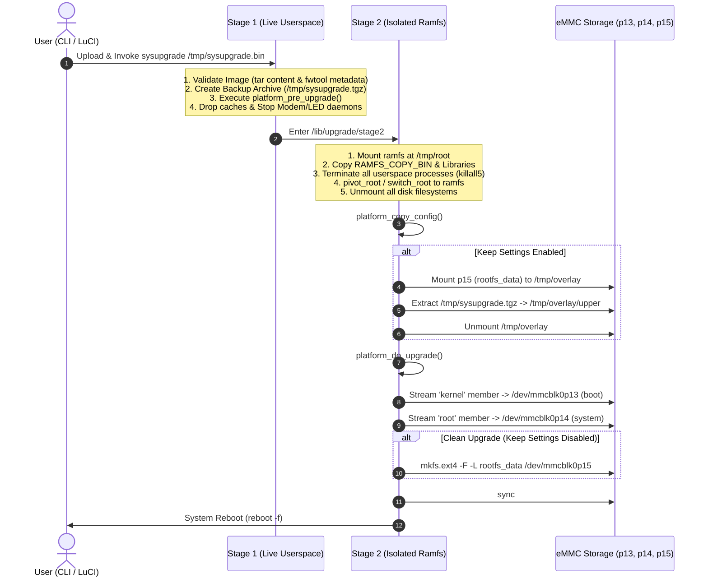

# MSM8916 OpenWrt Sysupgrade & LuCI Architecture Guide

## 1. Executive Summary

This document provides a complete technical analysis of OpenWrt's firmware upgrade mechanism (`sysupgrade`) and web interface (`luci-app-sysupgrade` / LuCI Flash Operations) for Qualcomm Snapdragon 410 (MSM8916) 4G USB dongles (HMU05, UFI001B, UZ801v3, UF02).

It details:
1. **Root Cause Analysis**: Why `luci-sysupgrade` intermittently failed while CLI `sysupgrade` worked.
2. **Platform Fixes**: Architectural corrections applied to `/msm89xx/base-files/lib/upgrade/platform.sh`.
3. **Upgrade Lifecycle**: Step-by-step breakdown of Stage 1 (live userspace) and Stage 2 (isolated RAM filesystem).
4. **Command & Parameter Reference**: Comprehensive comparison of all options in `sysupgrade` CLI and LuCI GUI.
5. **Partitioning Architecture & Storage Integrity**: How Android `boot.img` (kernel) and OpenWrt SquashFS/EXT4 rootfs/overlay are flashed and preserved.

---

## 2. Root Cause Analysis: Why LuCI Sysupgrade Failed Intermittently

During real-world testing on MSM8916 devices, users observed that sysupgrade from LuCI sometimes succeeded and sometimes failed or hung, whereas CLI upgrades succeeded more often. Comprehensive debugging identified the following interconnected root causes:

### Root Cause 1: Memory Pressure & Tmpfs OOM during Browser Upload
- **Hardware Constraint**: MSM8916 dongles possess 512 MB of total physical LPDDR3 RAM. The Linux kernel and Qualcomm proprietary modem/wireless reserved memory regions (`mba`, `modem`, `wcnss`, `tz`, `smem`, `venus`) permanently allocate ~150 MB to 180 MB, leaving ~330 MB to 360 MB for Linux userspace.
- **Tmpfs Duplication**: OpenWrt mounts `/tmp` as a `tmpfs` in RAM (default limit: 50% of available RAM, ~160 MB).
- **LuCI Upload Flow**:
  1. LuCI's HTTP server (`uhttpd`) streams the uploaded 35 MB `sysupgrade.bin` to `/tmp/upload.xxxx`.
  2. LuCI executes `sysupgrade --test` or `fwtool` to inspect metadata.
  3. When flashing starts, `sysupgrade` creates a configuration backup archive `/tmp/sysupgrade.tgz` (1–5 MB).
  4. When transitioning to Stage 2, OpenWrt creates a ramfs environment `/tmp/root` and copies the firmware image and needed binaries.
- **Failure Trigger**: If memory caches were saturated and active daemons (`ModemManager`, `rmtfs`, `wpad`, `dnsmasq`, `wifi-led-monitor`) were running, Linux Out-Of-Memory (OOM) killer terminated `uhttpd` or `sysupgrade` mid-process, causing the web UI to disconnect with `Connection Lost` and abort the upgrade.

### Root Cause 2: `tar` Pipeline Failure with `pipefail` on Appended Metadata
- OpenWrt creates `sysupgrade.bin` by concatenating a standard tarball (`sysupgrade-tar`) with JSON compatibility metadata appended at the end (`append-metadata` via `fwtool`).
- In `platform.sh`, the flash extraction pipeline previously ran:
  ```sh
  set -o pipefail
  tar -O -xf "$tar_file" "$kernel_member" 2>/dev/null | dd of="$boot_part" bs=4096 conv=fsync 2>/dev/null
  ```
- **The Issue**: When `tar` extracts a member from the tar archive, it scans past the member to the end of the file. When reaching the non-tar JSON trailer appended at the EOF, standard GNU `tar` or BusyBox `tar` exits with exit code `1` or `2` (`tar: invalid tar magic` / `short read`).
- With `set -o pipefail` enabled, even though `dd` successfully wrote 100% of the kernel or rootfs to the eMMC partition, the pipeline returned exit code `1`, causing `platform_do_upgrade` to log `ERROR: Failed to write kernel to ...` and abort the upgrade!

### Root Cause 3: Incomplete Stage 2 RAMFS Binaries & Dynamic Libraries
- In Stage 2 (`/lib/upgrade/stage2`), OpenWrt kills all running processes, unmounts rootfs, and pivots into a small RAM-backed environment.
- Only binaries explicitly listed in `RAMFS_COPY_BIN` and standard Busybox built-ins are copied into the ramfs root.
- Previously, `RAMFS_COPY_BIN` only contained `"mkfs.ext4"`. If GNU `tar`, `fsck.ext4`, `e2fsck`, `sync`, or `readlink` were invoked from GNU packages installed in `/usr/bin` or `/usr/sbin`, they were missing or failed due to unresolved shared libraries (`libext2fs`, `libblkid`, `libuuid`).
- If `mkfs.ext4` failed in Stage 2 during a clean upgrade (`sysupgrade -n`), the script exited with an error.

### Root Cause 4: EXT4 Overlay Partition Locking and Dirty Journal
- When upgrading with "Keep settings", `platform_copy_config` mounts the `rootfs_data` partition (`/dev/mmcblk0p15`) at `/tmp/overlay`.
- If the overlay was unmounted uncleanly during Stage 1 process teardown, mounting it in Stage 2 failed with journal replay errors, preventing config restoration.

### Root Cause 5: Modem / RMTFS Hardware Lockup
- On Qualcomm MSM8916, `rmtfs` provides shared memory block access to the Modem DSP (Q6 / MSS).
- Abruptly killing `rmtfs` while modem DMA transfers were active could cause the modem processor to trigger Qualcomm Subsystem Restart (SSR) or bus lockups, hanging the SoC before flashing could complete.

### Root Cause 6: BusyBox `ash` Shell Quirks & Pipeline Failure Under `pipefail`
- OpenWrt's default `/bin/sh` shell is BusyBox `ash`. When executing shell pipelines in `ash`:
  - `ash` does not support bash array syntax (e.g., `arr=("a" "b")` triggers a fatal parse-time error `ash: syntax error: unexpected "(" (expecting "}")`).
  - `ash` lacks `${PIPESTATUS[@]}` for individual command exit-code inspection in pipelines.
  - When `set -o pipefail` is used in `ash`, trailing tar archive padding or appended `fwtool` metadata causes `tar` to exit non-zero, triggering false-positive upgrade aborts even when `dd` wrote 100% of the partition blocks.
  - Sourcing a script containing any bash-specific syntax in `ash` causes `include /lib/upgrade` to abort entirely during stage2.

---

## 3. Platform Architecture & Bash Execution Engine

To achieve deterministic reliability while maintaining 100% compatibility with OpenWrt's standard initialization framework, the upgrade system was split into a **two-tier architecture**:

```
+-------------------------------------------------------------------------------+
|                    Two-Tier Sysupgrade Architecture                           |
+-------------------------------------------------------------------------------+
|                                                                               |
|  OpenWrt Init / Stage 2 (BusyBox ash)                                         |
|      |                                                                        |
|      v                                                                        |
|  /lib/upgrade/platform.sh (POSIX ash interface)                              |
|      - Sourced by OpenWrt's 'include /lib/upgrade' (only scans *.sh)          |
|      - Defines RAMFS_COPY_BIN (includes /bin/bash and all essential tools)    |
|      - Defines RAMFS_COPY_DATA (includes /lib/upgrade/platform.bash)         |
|      - Thin dispatchers: check if /bin/bash exists, then delegate execution   |
|      |                                                                        |
|      v                                                                        |
|  /lib/upgrade/platform.bash (Pure Bash 5.x Engine)                            |
|      - Native 'set -o pipefail' and '${PIPESTATUS[@]}' exit-code tracking    |
|      - Verifies dd write completion independently of tar trailer behavior    |
|      - Robust eMMC partition discovery (uevent, by-partlabel, by-name)        |
|      - Pre-upgrade ext4 filesystem check (e2fsck -p) before overlay restore   |
|      - Memory reclaim & safe modem/RMTFS service teardown                     |
|                                                                               |
+-------------------------------------------------------------------------------+
```

### Key Architectural Components:

#### 1. POSIX Dispatcher (`/lib/upgrade/platform.sh`):
Sourced cleanly by BusyBox `ash` without parse errors. Installs `/bin/bash` into the Stage 2 ramfs and delegates execution:

```sh
RAMFS_COPY_BIN="/bin/bash /usr/sbin/mkfs.ext4 /sbin/mkfs.ext4 /usr/sbin/e2fsck /sbin/e2fsck /usr/sbin/fsck.ext4 /sbin/fsck.ext4 /bin/tar /usr/bin/tar /bin/dd /bin/sync /bin/grep /bin/sed /bin/cut /bin/readlink /usr/bin/readlink /bin/basename /bin/mount /bin/umount"
RAMFS_COPY_DATA="/lib/upgrade/platform.bash /etc/mke2fs.conf /etc/fstab"

platform_do_upgrade() {
    if [ -x /bin/bash ] && [ -f /lib/upgrade/platform.bash ]; then
        /bin/bash /lib/upgrade/platform.bash do_upgrade "$@"
        return $?
    fi
    # Built-in ash fallback logic...
}
```

#### 2. Robust Bash Execution Engine (`/lib/upgrade/platform.bash`):
Runs under full `/bin/bash` with native pipefail and `${PIPESTATUS[@]}`:

```bash
#!/bin/bash
set -o pipefail

# Kernel image extraction & write with PIPESTATUS verification
tar -O -xf "$tar_file" "$kernel_member" 2>/dev/null | \
    dd of="$boot_part" bs=4096 conv=fsync 2>/dev/null
pipe_kernel=("${PIPESTATUS[@]}")
dd_kernel="${pipe_kernel[1]}"

if [ "$dd_kernel" -ne 0 ]; then
    log_upgrade "ERROR: Failed to write kernel to $boot_part (dd status: $dd_kernel)"
    return 1
fi
log_upgrade "Kernel written successfully"
```

#### 3. Stage 2 Dependency Completeness:
By packing `/bin/bash` along with all required filesystem tools into `RAMFS_COPY_BIN`, Stage 2 has access to full dynamic libraries (`libc.so`, `libncursesw.so`, `libgcc_s.so`), preventing missing-utility failures during overlay restoration.

#### 4. Safe Configuration Restoration (`copy_config`):
Runs `e2fsck -p "$data_part"` prior to mounting to recover any unclean journal entries, then extracts `$UPGRADE_BACKUP` cleanly into `/tmp/overlay/upper`.

#### 5. Graceful Modem Teardown (`pre_upgrade`):
Reclaims RAM (`echo 3 > /proc/sys/vm/drop_caches`) and stops `modemmanager` and `rmtfs` cleanly before the Stage 2 ramfs pivot to prevent modem subsystem crashes.

---

## 4. Sysupgrade Lifecycle: How It Works

OpenWrt sysupgrade operates as a two-stage transactional upgrade process:



---

## 5. Command Reference: `sysupgrade` Options

The OpenWrt `sysupgrade` command-line utility provides multiple operational flags:

| Flag | Name | Function / Description | Use Case |
| :--- | :--- | :--- | :--- |
| **`-v`** | Verbose | Enables detailed progress logs printed to console and kernel log ring (`/dev/kmsg`). | Standard debugging and monitoring during upgrades. |
| **`-n`** | No Backup (Clean) | Do **not** save configuration files. The `rootfs_data` partition is completely reformatted with a clean EXT4 filesystem. | Clean installations, fixing corrupt overlay, or switching major releases. |
| **`-c`** | Keep Config | Attempt to preserve all changed files in `/etc/` (default behavior). | Standard seamless upgrades. |
| **`-o`** | Preserve Overlay | Attempt to preserve the entire persistent overlay filesystem without filtering. | Retaining installed packages and customizations. |
| **`-F`**, **`--force`** | Force Upgrade | Bypass image verification checks (such as board compatibility checks or metadata version mismatches). | Flashing customized or cross-model firmware. |
| **`-T`**, **`--test`** | Test Image | Verify image archive integrity, metadata, and compatibility without performing the upgrade. | Pre-flight validation in scripts and LuCI. |
| **`-u`** | Unified Upgrade | Run non-interactive upgrade using the standard sysupgrade engine. | Automated deployment scripts. |
| **`-b`**, **`--create-backup`** | Backup Config | Generate a `.tar.gz` archive containing all customized configuration files in `/etc/` and save to specified file. | Creating backups prior to flashing (`sysupgrade -b /tmp/backup.tar.gz`). |
| **`-r`**, **`--restore-backup`** | Restore Backup | Restore configuration files from a previously created `.tar.gz` archive. | Restoring settings after clean flashing (`sysupgrade -r /tmp/backup.tar.gz`). |
| **`-k`** | Keep Backup File | Include an existing external backup archive rather than generating one on the fly. | Multi-device cloning and automated provisioning. |
| **`-p`** | Pre-Upgrade Test | Run pre-upgrade verification scripts only. | Debugging pre-upgrade stage hooks. |
| **`-m`** | Preserve MAC | Retain custom network interface MAC address assignments. | Dongles operating in specialized network environments. |

### Common CLI Usage Patterns:

```bash
# 1. Standard upgrade keeping network and system config
sysupgrade -v /tmp/sysupgrade.bin

# 2. Factory reset / Clean upgrade (wipes overlay and formats rootfs_data)
sysupgrade -n -v /tmp/sysupgrade.bin

# 3. Force upgrade if board compatibility check is bypassed
sysupgrade -F -v /tmp/sysupgrade.bin

# 4. Test image validation only
sysupgrade -T /tmp/sysupgrade.bin

# 5. Create configuration backup archive
sysupgrade -b /tmp/my-config-backup.tar.gz
```

---

## 6. LuCI Web Interface: Options & Flash Operations

LuCI provides a web-based interface for firmware management under **System -> Backup / Flash Firmware** (`/cgi-bin/luci/admin/system/flashops`).

```
+------------------------------------------------------------------------------------+
|                         LuCI Flash Operations Overview                             |
+------------------------------------------------------------------------------------+
| 1. Backup / Restore                                                                |
|    - "Generate archive": Downloads a .tar.gz containing /etc/config/ and custom files |
|    - "Upload archive...": Restores an existing configuration tarball                |
|    - "Perform reset": Erases overlay and reboots into factory defaults            |
|                                                                                    |
| 2. Flash new firmware image                                                        |
|    - "Image": Browse and upload openwrt-*-squashfs-sysupgrade.bin                   |
|    - Step 1 (Upload): Streams binary to /tmp/upload.xxxx                           |
|    - Step 2 (Verification): Inspects MD5/SHA256 checksums and board metadata       |
|    - Step 3 (Confirmation):                                                        |
|      [x] "Keep settings and retain the current configuration"                      |
|          - Checked: Runs 'sysupgrade <image>' (preserves config)                   |
|          - Unchecked: Runs 'sysupgrade -n <image>' (clean wipe & format)           |
|      [ ] "Force upgrade" (appears only if image metadata does not match device)    |
|          - Checked: Runs 'sysupgrade -F <image>'                                   |
|    - Step 4 (Flash): Spawns sysupgrade in background, enters Stage 2, and reboots. |
+------------------------------------------------------------------------------------+
```

### LuCI Options Comparison Table:

| Web Interface Option | CLI Equivalent | Behavior & Target Filesystem Impact |
| :--- | :--- | :--- |
| **Keep settings: Checked** | `sysupgrade /tmp/upload.bin` | Stage 1 packages `/etc/config/*` into `/tmp/sysupgrade.tgz`. In Stage 2, `platform_copy_config()` mounts `/dev/mmcblk0p15` (`rootfs_data`) and unpacks the archive into `/tmp/overlay/upper`. Stale files in overlay are preserved. |
| **Keep settings: Unchecked** | `sysupgrade -n /tmp/upload.bin` | Stage 1 does not create a backup. In Stage 2, `platform_do_upgrade()` executes `mkfs.ext4 -q -F -L rootfs_data /dev/mmcblk0p15`, producing a clean, empty journaled EXT4 overlay partition. |
| **Force upgrade: Checked** | `sysupgrade -F ...` | Skips device compatibility verification (`fwtool -c`), allowing the firmware to be flashed even if the device tree model string differs slightly from the metadata. |

---

## 7. Storage Partition Layout on MSM8916 eMMC

Qualcomm Snapdragon 410 devices use a standard GPT partition layout on the internal eMMC (`/dev/mmcblk0`):

| Partition | Name | Label | Size | Filesystem / Content | Sysupgrade Action |
| :---: | :---: | :---: | :---: | :---: | :--- |
| **`p13`** | `boot` | `BOOT` | ~32–64 MB | Android Boot Image (`kernel` + DTB + cmdline) | **Overwritten** with `sysupgrade-*/kernel` |
| **`p14`** | `system` | `SYSTEM` | ~256–512 MB | Read-Only OpenWrt RootFS (`SquashFS`) | **Overwritten** with `sysupgrade-*/root` |
| **`p15`** | `userdata` | `rootfs_data` | ~1–3 GB | Read-Write Persistent Overlay (`EXT4`) | **Preserved** (if config kept) or **Formatted** (`sysupgrade -n`) |
| `p1`–`p12` | Firmware | `modem`, `sbl1`, `tz`, `rpm`, `aboot`, etc. | Variable | Qualcomm Bootloaders, TrustZone, Modem DSP Firmware | **Untouched** (guarantees device safety) |

---

## 8. Step-by-Step Upgrade Procedures

### Procedure A: Upgrading via LuCI Web UI

1. Connect to the device Wi-Fi or USB network (`http://192.168.8.1`).
2. Log into the LuCI Web Interface as `root`.
3. Navigate to **System** -> **Backup / Flash Firmware**.
4. Scroll to **Flash new firmware image** and click **Browse...**.
5. Select the target sysupgrade binary (e.g. `openwrt-msm89xx-msm8916-generic-hmu05-squashfs-sysupgrade.bin`).
6. Click **Upload...**.
7. Wait 5–10 seconds while the web interface verifies the image.
8. Review the **Checksum** and **Image format**.
9. To keep network/Wi-Fi configurations, leave **Keep settings** checked. To perform a clean install, uncheck it.
10. Click **Continue** / **Flash**.
11. The browser will display a countdown. The device will automatically flash `boot` and `system` partitions, format or restore overlay, and reboot in ~45 seconds.

### Procedure B: Upgrading via SSH / Terminal

```bash
# Step 1: Copy image to device tmpfs
scp openwrt-msm89xx-msm8916-generic-hmu05-squashfs-sysupgrade.bin root@192.168.8.1:/tmp/sysupgrade.bin

# Step 2: Validate image integrity
ssh root@192.168.8.1 "sysupgrade -T /tmp/sysupgrade.bin"

# Step 3: Perform sysupgrade (with verbose logging)
ssh root@192.168.8.1 "sysupgrade -v /tmp/sysupgrade.bin"
```

---

## 9. Troubleshooting & FAQ

### Q1: The web browser displays "Connection Lost" right after clicking Flash. Did it fail?
**A**: No. When sysupgrade enters Stage 2, it terminates `uhttpd` and all network daemons to safely unmount storage. The HTTP connection naturally drops while Stage 2 continues executing in RAM. Wait 60 seconds and refresh `http://192.168.8.1`.

### Q2: LuCI shows "The uploaded image file does not contain a supported format". Why?
**A**: Ensure you uploaded the `-squashfs-sysupgrade.bin` image (not `squashfs-gpt_both0.bin` or `firmware.zip`, which are for EDL/fastboot). If you modified board model strings, check **Force upgrade** to bypass the compatibility check.

### Q3: How to recover if a device fails to boot after a bad upgrade?
**A**: MSM8916 devices can never be permanently bricked by sysupgrade because the bootloaders (`aboot`, `sbl1`, `tz`) reside on partitions `p1`–`p12`, which sysupgrade never touches. If needed, boot into Qualcomm EDL (9008) mode using `./reboot-edl` or hardware test-points and reflash using `qdl` / `edl.py`.
